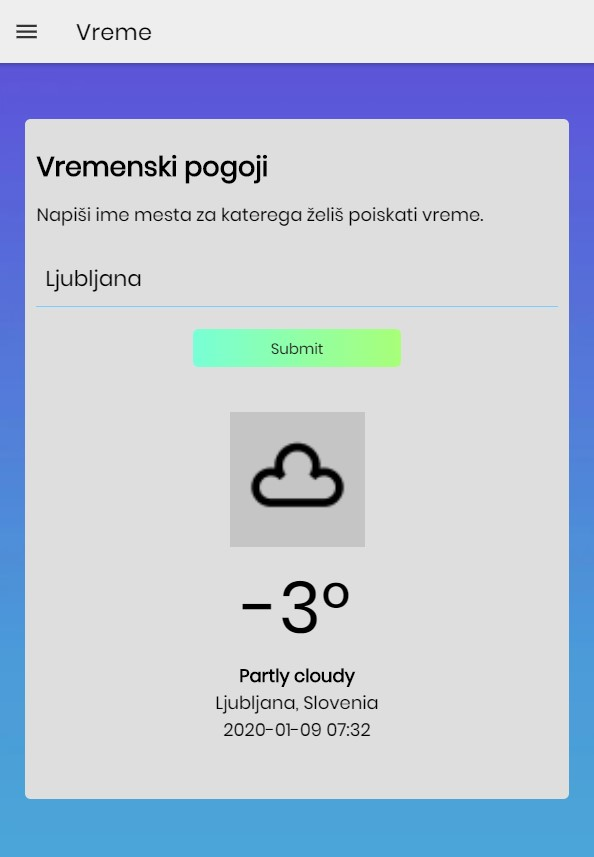
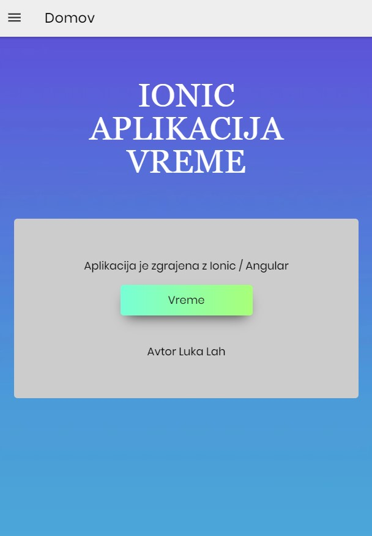
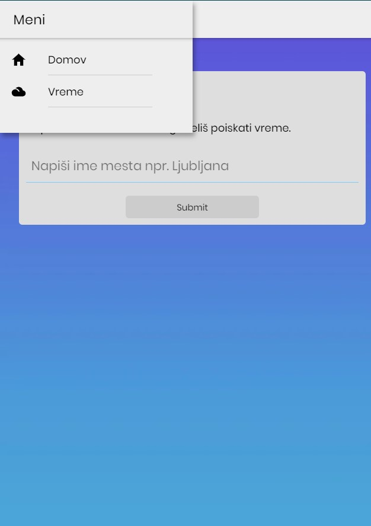

# Simple_weather_ionic-angular
Simple weather app based on ionic 5 and angular 7 made for android. It is using weatherstack API to read weather.

      


## Getting started
1. Download the project
2. Run: ```npm install``` or even better ```yarn add install```
3. Run: ```ionic serve```

## Prerequisites
* NodeJS (used npm version 6.10.2 and node 12.9.1)
* Ionic (5.0.0)

## Built with
* Jasmine
* Karma
* ...

## Tasks
- [x] Weather API
- [x] Components
- [x] Services
- [x] Styles and menu


## License


## Authors
```JavaScript
let AUTHOR = "Luka Lah"; //https://github.com/Lahlukap669
```
